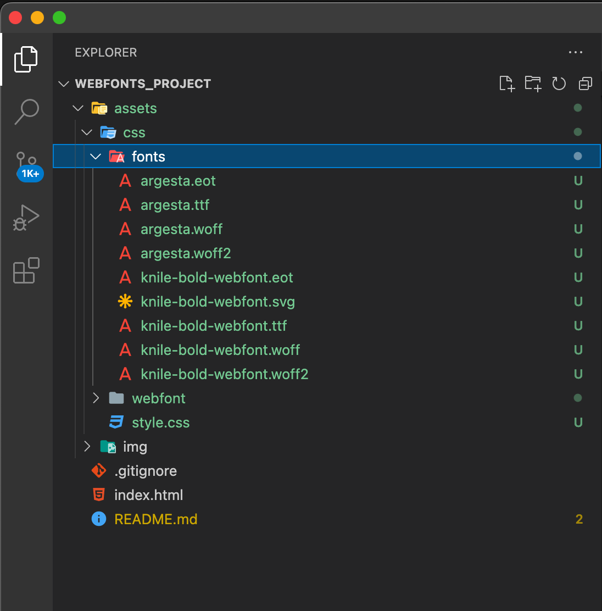

# This is a sample of how to use webfonts

assets folder is excluded form the git repo as it contains commertial fonts with a license for Digital Mind Solutions

The attached screen shows the content of the folder

.

style.css file content is here:

```
@font-face {
    font-family: 'argesta';
    src: url('fonts/argesta.eot');
    src: url('fonts/argesta.eot?#iefix') format('embedded-opentype'),
        url('fonts/argesta.woff') format('woff'),
        url('fonts/argesta.ttf') format('truetype'),
        url('fonts/argesta.svg#webfont') format('svg');

        font-family: 'knileblack';
            src: url('fonts/knile-bold-webfont.eot');
            src: url('fonts/knile-bold-webfont.eot?#iefix') format('embedded-opentype'),
            url('fonts/knile-bold-webfont.woff2') format('woff2'),
            url('fonts/knile-bold-webfont.woff') format('woff'),
            url('fonts/knile-bold-webfont.ttf') format('truetype'),
            url('fonts/knile-bold-webfont.svg#knileblack') format('svg');
            font-weight: normal;
            font-style: normal;
}

article {
    padding: 20px;
}

h1 {
    font-family: 'knileblack', Arial, Helvetica, sans-serif;
    font-size: 32px;
}
article p {
    font-family: 'argesta', Georgia, 'Times New Roman', Times, serif;
    font-size:18px;
}
footer p {
    font-size: 14px;;
}

@media (min-width: 599px) {
    article { 
        display: flex;
    flex-direction: column;
        max-width: 860px;
        margin: 0 auto;
}
    h1 {font-size:80px;}
    article p {font-size:48px;}
    footer p {
        font-size: 14px;;
    }
}

```

